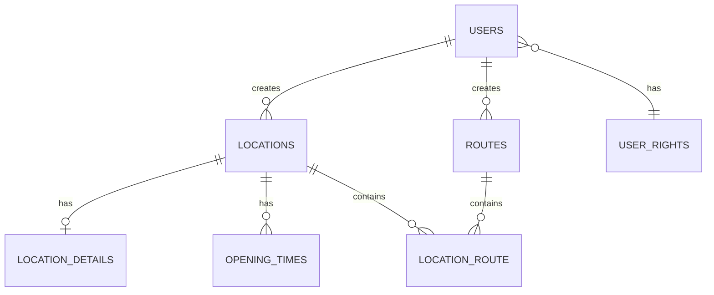

# 🗺️ Routeplanner API

A comprehensive ASP.NET Core Web API for managing locations, routes, and users with JWT authentication and PostgreSQL database integration. This backend service provides endpoints for creating, reading, updating, and deleting locations and routes, with user authentication and authorization.

## 🚀 Features

- **Location Management**: CRUD operations for locations with detailed information
- **Route Planning**: Create and manage routes with multiple locations
- **User Authentication**: JWT-based authentication system with user registration and login
- **Database Integration**: PostgreSQL database with Entity Framework Core
- **API Documentation**: Swagger/OpenAPI documentation
- **Unit Testing**: Comprehensive test suite using xUnit and Moq
- **Dependency Injection**: Clean architecture with repository pattern and Unit of Work

## 📋 Table of Contents

- [Architecture](#️-architecture)
- [Prerequisites](#-prerequisites)
- [Installation](#️-installation)
- [Configuration](#️-configuration)
- [Running the Application](#-running-the-application)
- [API Endpoints](#-api-endpoints)
- [Testing](#-testing)
- [Project Structure](#-project-structure)

## 🏗️ Architecture

The project follows a clean architecture pattern with:

- **Controllers**: Handle HTTP requests and responses
- **Unit of Work (UoW)**: Business logic layer that coordinates between controllers and repositories
- **Database Queries**: Data access layer implementing repository pattern
- **DTOs**: Data Transfer Objects for API communication
- **Models**: Entity Framework Core models representing database tables
- **Mappers**: AutoMapper profiles for object-to-object mapping
- **Extensions**: Configuration validation and JWT settings
- **Helpers**: Utility classes for JWT token generation

```
┌─────────────────┐    ┌─────────────────┐    ┌─────────────────┐
│   Controllers   │────│   Unit of Work  │────│ Database Queries│
└─────────────────┘    └─────────────────┘    └─────────────────┘
         │                       │                       │
         │                       │                       │
         ▼                       ▼                       ▼
┌─────────────────┐    ┌─────────────────┐    ┌─────────────────┐
│      DTOs       │    │     Mappers     │    │     Models      │
└─────────────────┘    └─────────────────┘    └─────────────────┘
```

### Database Schema

The database follows a relational model with Entity Framework Core models. The following diagram shows the relationships between the C# entities:



## 📋 Prerequisites

- [.NET 8.0 SDK](https://dotnet.microsoft.com/download/dotnet/8.0)
- [PostgreSQL](https://www.postgresql.org/download/) database server
- [Visual Studio 2022](https://visualstudio.microsoft.com/) or [VS Code](https://code.visualstudio.com/) (recommended)
- [Git](https://git-scm.com/)

## 🛠️ Installation

1. **Clone the repository**
   ```bash
   git clone <repository-url>
   cd Backend
   ```

2. **Restore dependencies**
   ```bash
   cd Routeplanner_API
   dotnet restore
   ```

3. **Build the project**
   ```bash
   dotnet build
   ```

## ⚙️ Configuration

### Environment Variables

Create a `.env` file in the `Routeplanner_API` directory with the following variables:

```env
# Database Configuration
ConnectionStrings__DefaultConnection=Host=your-host;Port=5432;Username=your-username;Password=your-password;Database=your-database
ConnectionStrings__ThijsHROConnection=Host=fallback-host;Port=5432;Username=fallback-username;Password=fallback-password;Database=fallback-database

# JWT Configuration
Jwt__Secret=your-super-secret-jwt-key-minimum-32-characters-long
Jwt__Issuer=https://your-issuer.com
Jwt__Audience=https://your-audience.com
Jwt__ExpiryMinutes=180
```

### Configuration Files

- `appsettings.json`: Base configuration
- `appsettings.Development.json`: Development-specific settings

## 🚀 Running the Application

### Development Mode

```bash
cd Routeplanner_API
dotnet run
```

The API will be available at:
- **HTTPS**: `https://localhost:7045`
- **HTTP**: `http://localhost:5045`
- **Swagger UI**: `https://localhost:7045/swagger`

### Production Mode

```bash
dotnet run --environment Production
```

## 📚 API Endpoints

### Authentication

| Method | Endpoint | Description | Auth Required |
|--------|----------|-------------|---------------|
| POST | `/api/User` | Register new user | ❌ |
| POST | `/api/User/Login` | User login | ❌ |

### Users

| Method | Endpoint | Description | Auth Required |
|--------|----------|-------------|---------------|
| GET | `/api/User` | Get all users | ✅ |
| GET | `/api/User/{id}` | Get user by ID | ✅ |
| PUT | `/api/User/{id}` | Update user | ✅ |

### Locations

| Method | Endpoint | Description | Auth Required |
|--------|----------|-------------|---------------|
| GET | `/api/Location` | Get all locations | ❌ |
| GET | `/api/Location/{id}` | Get location by ID | ❌ |
| GET | `/api/Location/categories` | Get unique categories | ❌ |
| GET | `/api/Location/selectable` | Get selectable locations | ❌ |
| POST | `/api/Location` | Create location | ✅ |
| PUT | `/api/Location/{id}` | Update location | ✅ |
| DELETE | `/api/Location/{id}` | Delete location | ✅ |

### Routes

| Method | Endpoint | Description | Auth Required |
|--------|----------|-------------|---------------|
| GET | `/api/Route` | Get all routes | ❌ |
| GET | `/api/Route/{id}` | Get route by ID | ❌ |
| POST | `/api/Route` | Create route | ✅ |
| PUT | `/api/Route/{id}` | Update route | ✅ |
| DELETE | `/api/Route/{id}` | Delete route | ✅ |

### Authentication

All authenticated endpoints require a Bearer token in the Authorization header:
```
Authorization: Bearer <your-jwt-token>
```

## 🧪 Testing

The project includes comprehensive unit tests using xUnit, Moq, and Entity Framework In-Memory database.

### Running Tests

```bash
cd Test_API
dotnet test
```

### Test Coverage

- **Location Database Queries**: CRUD operations testing
- **Unit of Work**: Business logic testing
- **Mocking**: Repository and mapper mocking
- **In-Memory Database**: Isolated test environment

### Test Structure

```
Test_API/
├── Database Queries Tests/
│   └── LocationDbQueriesTests.cs
├── Helpers Tests/ (placeholder)
└── UoWs Tests/ (placeholder)
```

## 📁 Project Structure

```
Backend/
├── 📄 README.md
├── 📄 config.js                    # OpenRouteService API keys
├── 🗂️ Routeplanner_API/           # Main API project
│   ├── 📄 Program.cs               # Application entry point
│   ├── 📄 Routeplanner_API.csproj  # Project configuration
│   ├── 🗂️ Controllers/            # API Controllers
│   │   ├── 📄 LocationController.cs
│   │   ├── 📄 RouteController.cs
│   │   └── 📄 UserController.cs
│   ├── 🗂️ Data/                   # Entity models
│   │   ├── 📄 RouteplannerDbContext.cs
│   │   ├── 📄 User.cs
│   │   ├── 📄 Location.cs
│   │   ├── 📄 Route.cs
│   │   └── 📄 ...
│   ├── 🗂️ Database Queries/       # Repository implementations
│   │   ├── 📄 ILocationDbQueries.cs
│   │   ├── 📄 LocationDbQueries.cs
│   │   └── 📄 ...
│   ├── 🗂️ DTO/                    # Data Transfer Objects
│   │   ├── 🗂️ Location/
│   │   ├── 🗂️ Route/
│   │   └── 🗂️ User/
│   ├── 🗂️ UoWs/                   # Unit of Work implementations
│   │   ├── 📄 LocationUoW.cs
│   │   ├── 📄 RouteUoW.cs
│   │   └── 📄 UserUoW.cs
│   ├── 🗂️ Mappers/                # AutoMapper profiles
│   │   ├── 📄 LocationProfile.cs
│   │   ├── 📄 RouteProfile.cs
│   │   └── 📄 UserProfile.cs
│   ├── 🗂️ Extensions/             # Configuration extensions
│   │   ├── 📄 ConfigurationExtensions.cs
│   │   └── 📄 JwtSecretExtension.cs
│   ├── 🗂️ JWT/                    # JWT configuration
│   │   └── 📄 JwtSettings.cs
│   └── 🗂️ Helpers/                # Helper utilities
│       ├── 📄 IUserHelper.cs
│       └── 📄 UserHelper.cs
└── 🗂️ Test_API/                   # Test project
    ├── 📄 Test_API.csproj
    └── 🗂️ Database Queries Tests/
        └── 📄 LocationDbQueriesTests.cs
```

## 📦 Dependencies

### Main Project

- **Microsoft.EntityFrameworkCore** (9.0.4) - ORM for database operations
- **Npgsql.EntityFrameworkCore.PostgreSQL** (9.0.4) - PostgreSQL provider
- **Microsoft.AspNetCore.Authentication.JwtBearer** (8.0.16) - JWT authentication
- **AutoMapper.Extensions.Microsoft.DependencyInjection** (12.0.1) - Object mapping
- **Swashbuckle.AspNetCore** (6.6.2) - API documentation
- **DotNetEnv** (3.1.1) - Environment variable loading

### Test Project

- **xUnit** (2.9.3) - Testing framework
- **Moq** (4.20.72) - Mocking framework
- **Microsoft.EntityFrameworkCore.InMemory** (9.0.4) - In-memory database for testing

## 🔧 Development Tools

### Package Manager Commands

```bash
# Add migration
dotnet ef migrations add YourMigrationName

# Update database
dotnet ef database update

# Install package
dotnet add package PackageName

# Run with watch (auto-reload)
dotnet watch run
```

---
